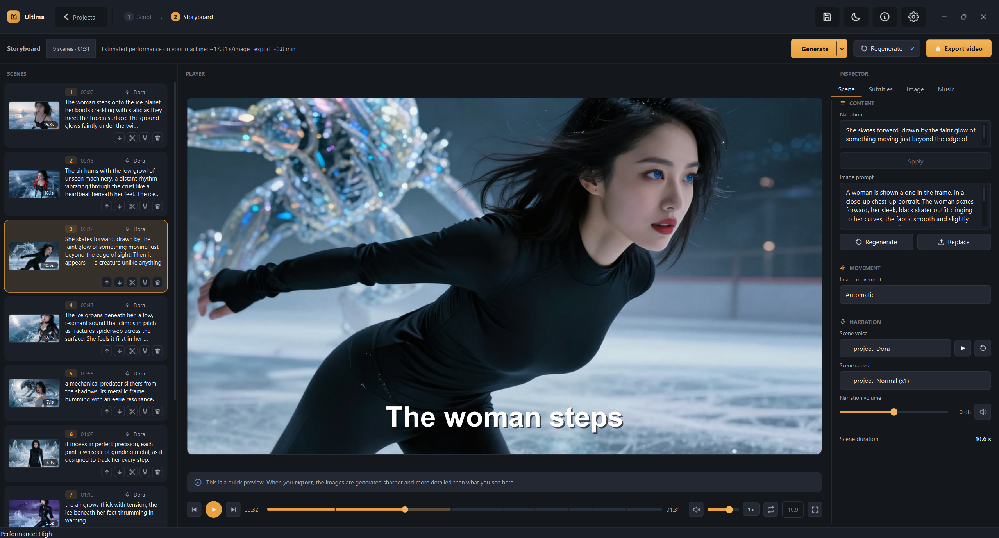
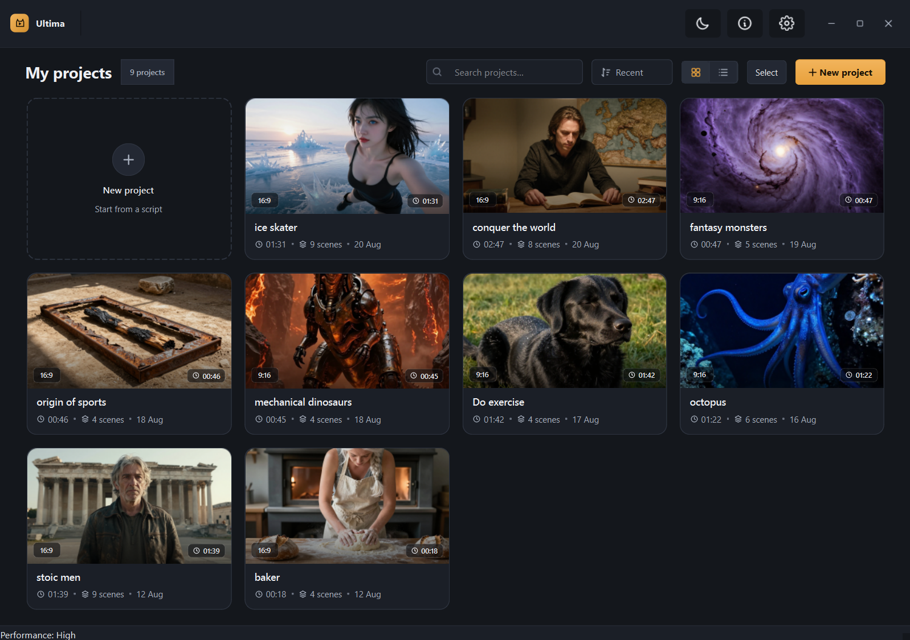
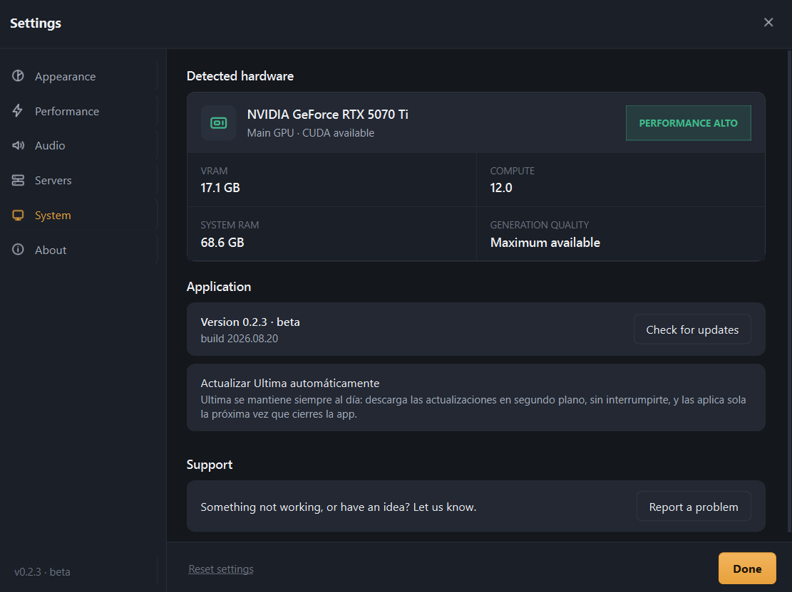

# Ultima

Ultima turns a script into a narrated video with AI-generated images, running on your own machine by default. No cloud rendering, no subscription. There's an optional remote-server mode for machines without a compatible GPU (see below) — outside of that, nothing about your script or footage gets uploaded anywhere.



Write or paste a script and Ultima breaks it into scenes, generates an image and a narration line for each one, and lays them out in a timeline you can edit before exporting. Image generation, text-to-speech, and subtitles all run locally on your GPU.

## Status

Ultima is in beta. A small group of testers uses it daily, but there's no code-signing certificate yet, so Windows will flag the installer as coming from an unknown publisher (see below). Expect rough edges.

## Requirements

- Windows 10/11, 64-bit
- NVIDIA GPU, GTX 16-series or newer, 6 GB VRAM minimum
- Around 10 GB free disk space for the app itself, more for projects and cached models

AMD and Intel GPUs aren't supported yet — the generation pipeline is built on CUDA.

## No compatible GPU? Run a remote server instead

[](https://colab.research.google.com/github/ddlara01/ultima-beta/blob/main/colab/ultima_remote_server.ipynb)

Settings → Servers in the app lets you point image generation and/or the script LLM at a remote server instead of your local GPU. The notebook above sets one up on Colab's free tier and gives you a URL to paste in there.

It works, but the free tier's GPU/RAM is tight: run either image generation or the LLM at a time, not both — the notebook defaults to image-only and warns about this before you turn on the second one. Whatever server you point the app at (this one or your own) receives your script and prompts as plain text, so only use one you trust.

## Download

The installer is hosted on Hugging Face — it's over 2 GB, past GitHub's release size limit: **[ddlara01/ultima-releases](https://huggingface.co/ddlara01/ultima-releases)**

After downloading, verify the file before running it:

```powershell
Get-FileHash Ultima-Setup-X.Y.Z.exe -Algorithm SHA256
```

Compare the result against the `.sha256` file next to the installer. If it doesn't match, don't run it — could be a corrupted download or, worst case, a tampered file.

### Installing without a code-signing certificate

Windows will show a couple of warnings on install. They're expected, not a sign anything is wrong — here's what they mean and how to get past them:

**SmartScreen ("Windows protected your PC")** — shows up because the installer has no publisher reputation yet, not because anything was detected. Click "More info", then "Run anyway".

**Antivirus quarantine / Smart App Control** — some antivirus software quarantines the installer or `Ultima.exe` on first run, or Smart App Control blocks it outright ("we couldn't verify the publisher"). Same root cause as SmartScreen: an unsigned, Nuitka-packaged binary that touches GPU/network/disk trips heuristics by default. If your antivirus quarantined it, restore it from there (Windows Security → Virus & threat protection → Protection history → find the entry → Restore). If Smart App Control is in Enforced mode, it may keep blocking unknown binaries even after Microsoft has scanned them — open an issue if that happens.

Verify the hash above first. If it matches, the file is genuine and the warning is a known false positive, not evidence of tampering.

## Updates

Ultima checks for updates on launch and downloads them in the background. Most updates are a small delta (only the files that actually changed) rather than the full installer. You'll get a notification with a link to the download progress in Settings, and a prompt to restart once it's ready.

## Screenshots




## Source

The source isn't public. This repository only hosts the update manifest the app checks against and release notes.

---

## En español

Ultima convierte un guion en un video narrado con imágenes generadas por IA, corriendo en tu propia máquina por defecto — sin renderizado en la nube, sin suscripción. Está en beta: la usa un grupo chico de testers a diario, pero todavía no tiene firma de código (Windows va a avisar "editor desconocido" al instalar) y quedan asperezas por pulir. Requiere GPU NVIDIA (GTX 16xx o superior, 6 GB de VRAM mínimo); AMD/Intel no están soportadas todavía. Si no tenés GPU compatible, hay un modo de servidor remoto (Ajustes → Servidores) con un [cuaderno de Colab gratis](https://colab.research.google.com/github/ddlara01/ultima-beta/blob/main/colab/ultima_remote_server.ipynb) — funciona, pero con la capacidad gratuita hay que usar un modelo a la vez (imagen o guion, no los dos). El instalador está en Hugging Face, que no tiene el límite de 2GB de GitHub: [ddlara01/ultima-releases](https://huggingface.co/ddlara01/ultima-releases).
